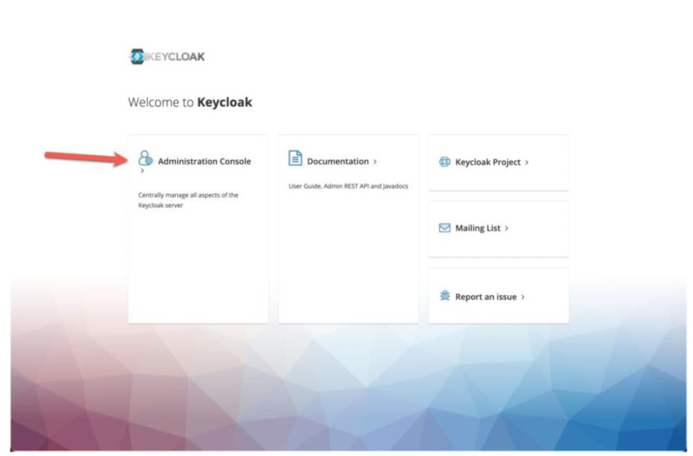
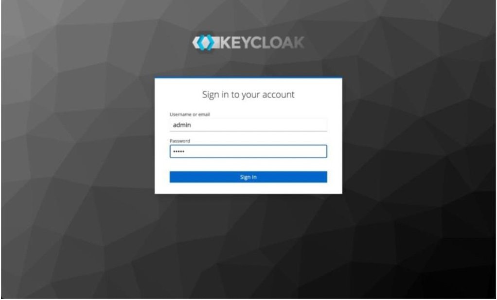
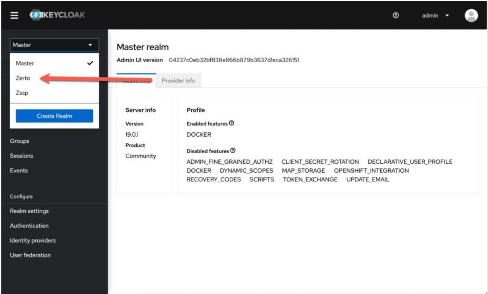
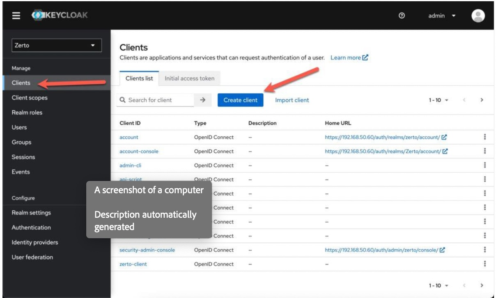
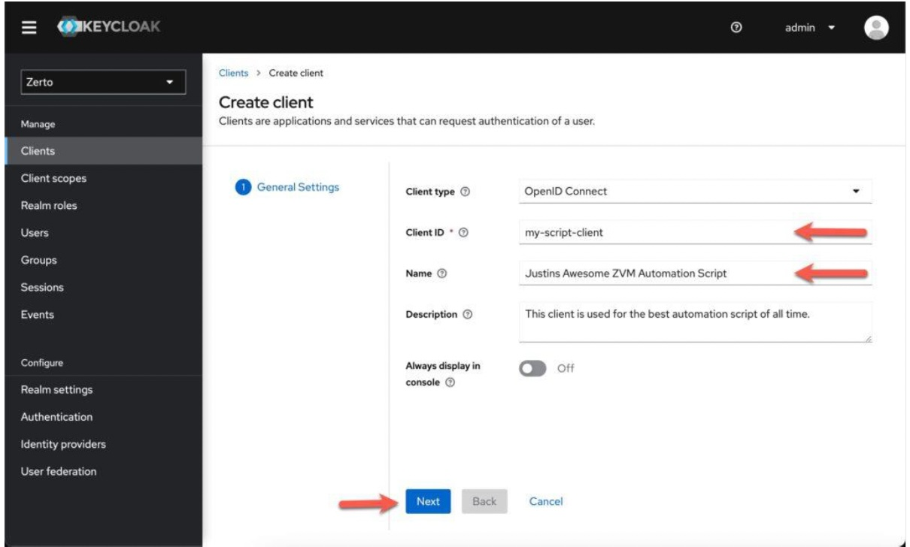
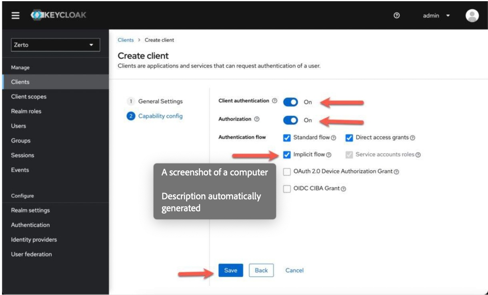
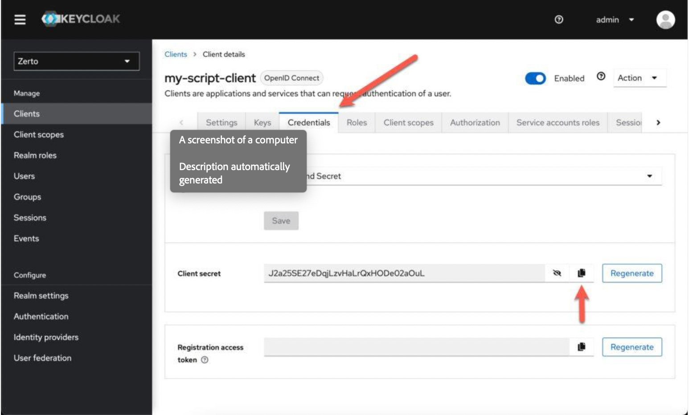

# Exercise 1: Introduction to Zerto APIs

## Overview
This exercise introduces you to Zerto's REST API and the Python SDK. You'll learn about the API structure, authentication methods, and basic concepts.

## Objectives
- Understand Zerto's REST API architecture
- Learn about Keycloak authentication
- Review API documentation
- Set up your development environment

## Time
5 minutes

## Prerequisites
- Python 3.8 or higher installed
- Access to Zerto API documentation
- Basic understanding of REST APIs

## Exercise Steps
1. Review the API documentation
2. Understand the authentication flow
3. Explore the SDK structure

## Key Concepts
- REST API basics
- Keycloak authentication
- API endpoints
- SDK architecture

## 2. Understand the Authentication Flow

Zerto uses **Keycloak** as its authentication provider. Understanding this flow is crucial for working with the Zerto APIs. Here's the step-by-step process:

### Step 1: Log in to Keycloak
From any browser, navigate to https://<zvmipaddress>/auth.

If this is your first time logging in, and you didn’t already change the password, use the default login information:
• Username: admin
• Password: admin

Once logged in, make sure you are in the "Zerto realm," as per the screenshot below:

### Step 2: Create a New Client

Next, click on the "Clients" link in the left menu. Then, click "Create Client.".

Now, provide a client_ID. The rest of the info on this page is optional. Click "Next".

On the two next screen, we need to check a few boxes. 
The arrows point out the things you want to have enabled. 
These options allow scripts to get a JSON Web Token (JWT) without interactively logging in.

### Step 3: Gather Your Credentials
Once Keycloak has created the client, it will bring you to a screen with many tabs for this client. 
Click on the "Credentials" tab, and then copy the client secret.

Now you have your username (client_id) and password (client_secret) for your script.

### Authentication Flow Summary

1. **Client Credentials Flow**: Your application uses the Client ID and Client Secret to obtain an access token
2. **Token Exchange**: The access token is exchanged for API access
3. **API Requests**: Include the access token in the Authorization header for all API calls

### What You'll Need for the Exercises

For the hands-on exercises, you'll need to:
1. Create a Keycloak client following the steps above
2. Note down your Client ID and Client Secret
3. Update the `prerequisites/config.py` file with these credentials
4. Ensure your client has the necessary permissions to access Zerto APIs

## Next Steps
Proceed to Exercise 2: Authentication to start working with the SDK and implement the authentication flow in code. 